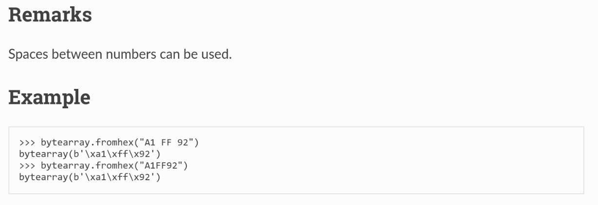

# 404CTF2026 - Crypto  - Dur à CERNer 

## Description du CTF

Le CERN tente une nouvelle manière d'obtenir des collisions de particules en les envoyant une par une.  
Si cette méthode marchait, cela permettrait de drasiquement réduire le coût des opérations !  
Malheureusement, les chances d'obtenir une collision semblent astronomiquement faibles...  

## Analyse

L'extrait du fichier chall.py qui nous intéresse est le suivant : 
```python
if __name__ == "__main__":
    print("> ", end="")
    particule_a = input()

    print("> ", end="")
    particule_b = input()

    if particule_a == particule_b:
        exit(1)

    try:
        resultat = accélérateur_de_particules(particule_a, particule_b)
  
```

Voici la fonction accélérateur_de_particules en question :

```python
def accélérateur_de_particules(particule_a : str, particule_b : str) -> bool:
    sha256 = hashlib.sha256()
    sha256.update(bytes.fromhex(particule_a))
    position_particule_a = sha256.digest()

    sha256 = hashlib.sha256()
    sha256.update(bytes.fromhex(particule_b))
    position_particule_b = sha256.digest()

    return position_particule_a == position_particule_b
 ``` 
    

Le flag est donné si cette fonction retourne Vrai.  
Il s'agit donc de trouver deux strings différents (particule_a != particule_b) mais qui donnent le même hash.

En vérifiant la documentation de bytes.fromhex():   



Il suffit donc de fournir 10 11 et 1011, qui sont techniquement des strings différents mais qui donnent le même résultat par la fonction bytes.fromhex().

https://python-reference.readthedocs.io/en/latest/docs/bytearray/fromhex.html#remarks
