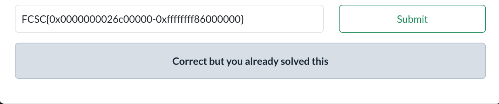

# FCSC26 - Forensic - Adresses du noyau - Un peu d'aléa

## Description

You receive RAM captures on three machines, and you are looking for the address of the first kernel instruction (using the _stext function) for each of them.

The flag is in the format FCSC{phys-virt} where:

    phys is the physical address of the first kernel instruction,
    virt is the virtual address of the first kernel instruction in the kernel text mapping.

All addresses are 64 bits, in hexadecimal format with a 0x prefix.

For example : FCSC{0x0123456789abcdef-0xfedcba9876543210}.

Warning : for this challenge, you have only 10 attempts.

---

## Resolution

I worked on the strings output of the given mem file.  

strings random.mem > strings.txt

First we use the hint given in the description :

grep "_stext" strings.txt

SYMBOL(_stext)=ffffffff86000000  
SYMBOL(_stext)=ffffffff86000000  
_stext  

So we found the virtual address. Now onto the physical address :  

grep "phys" strings.txt 

The output is more than 300+ lines however only one line contains an actual address:  

NUMBER(phys_base)=549453824

which equals to 0x20c00000 in hexadecimal.  

After some research i understood i had to convert the virtual address
to the physical address. This is what i found :  

https://docs.kernel.org/arch/x86/x86_64/mm.html  

  

So if ffffffff80000000 is a virtual address that maps to physical address 0, then the physical address of ffffffff86000000 maps to 0x06000000.

But that is in the case where phys_base equals 0.  
We have to add the phys_base that we found.  
Thus phys=0x20c00000+0x06000000.  

The reason why the challenge was called "Un peu d'aléa" (Some randomization) is because of KASLR : Kernel Address Space Layout Randomization. This is the final hint that lead me to find the flag.

