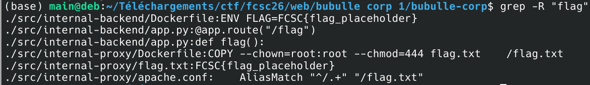
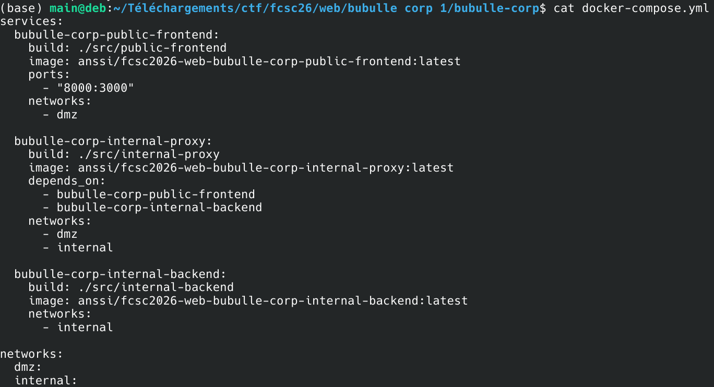
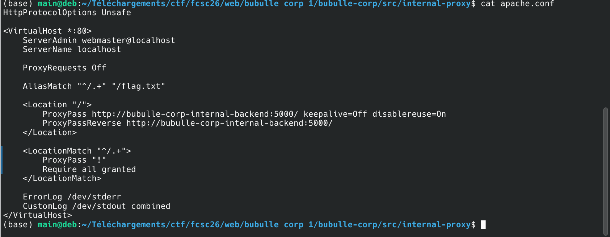
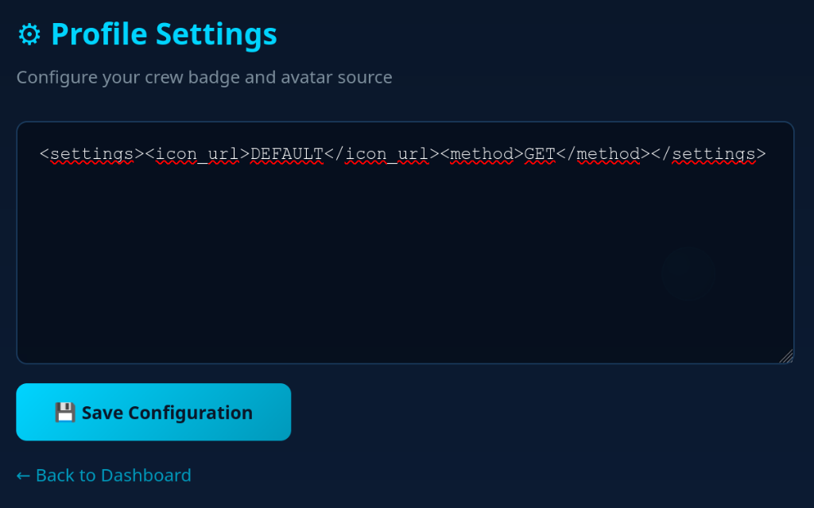
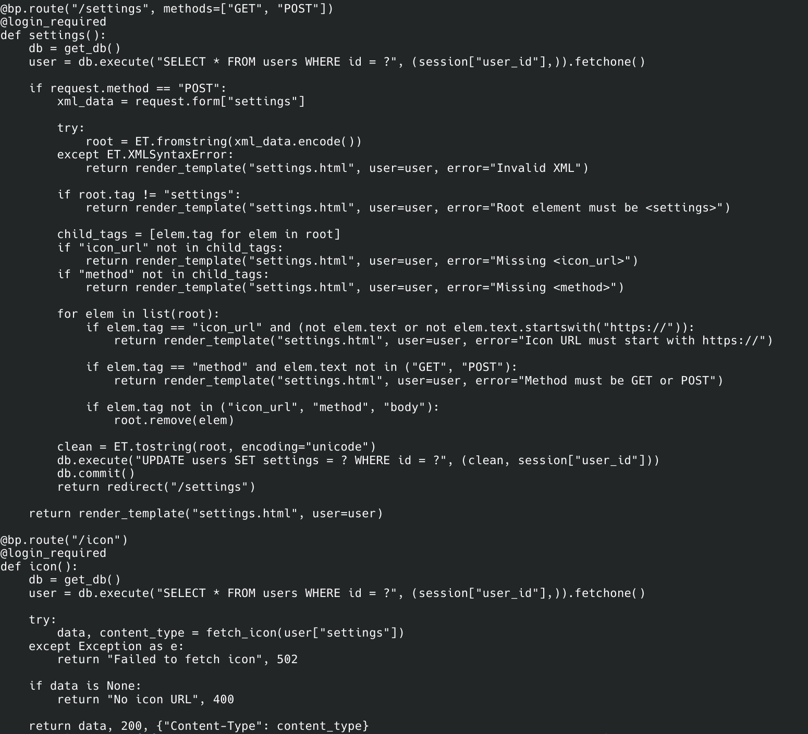
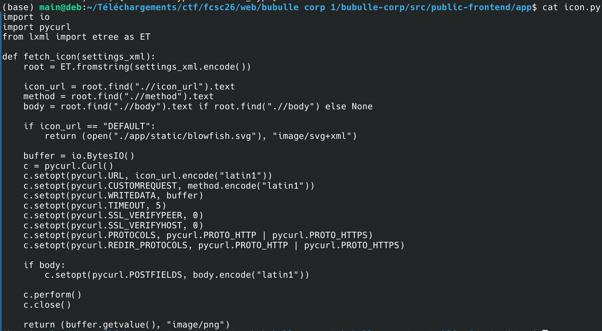
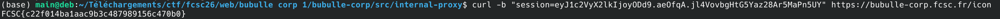

# FCSC26 - Web - Bubulle-Corp

## Description

Bubulle Corp is hiring!  
Join our team of marine experts and help us monitor high-seas operations from our brand-new dashboard.  
As a new recruit, you'll have access to fleet tracking, fishing reports, and depth analyses.  
But rumor has it the captain is hiding his secret paella recipe somewhere on the platform...  
Can you find it?  

---

## Resolution

The description mentions a secret paella recipe but it's just flavor text.
However we can quickly find out where to look for the flag :



The fourth line tells us the proxy copied the backend flag.txt file. 

Let's check the structure of the network :  



So the proxy is not exposed to the user. We have to interact with the proxy through the frontend, probably with a Server-Side Request Forgery.  
We already know the malicious path in the attack thanks to the AliasMatch in the apache.conf file: http://bubulle-corp-internal-proxy/ followed by something that matches the AliasMatch (any non-empty path)   



When we create an account on the website, the only thing we can do is to change our profile icon.



To understand specifically how the request is processed we analyse the routes.py file :  



We see how the route /settings works and then how the route /icon works.  
It returns the first direct child tag "icon_url", but only if it starts with "https://". 
Let's analyze the fetch_icon() function from icon.py being called in icon():  



Thus we deduce that to get the flag we do an SSRF (Server Side Request Forgery) attack :   
We have to send a request that contains the path mentioned earlier.  
This will give us the content of flag.txt.

In the settings function, this request will go through because
it only looks at the direct children, so it will not notice
the malicious http in the grandchild icon_url : it doesn't look for another tag inside the method tag.  

However in the fetch_icon function, the first icon_url tag will
be returned, no matter if it's a direct or indirect child.  

Thus the following xml satisfies the requirement of providing a dummy https for the settings() function while also providing the malicious http to get the flag.  

```xml
<settings><method>GET<icon_url>http://bubulle-corp-internal-proxy/x</icon_url></method><icon_url>https://x</icon_url></settings>
```

After entering this request, we submit it by clicking the Save Configuration button (http POST).  
We can then retrieve the flag by triggering the /icon route :  


