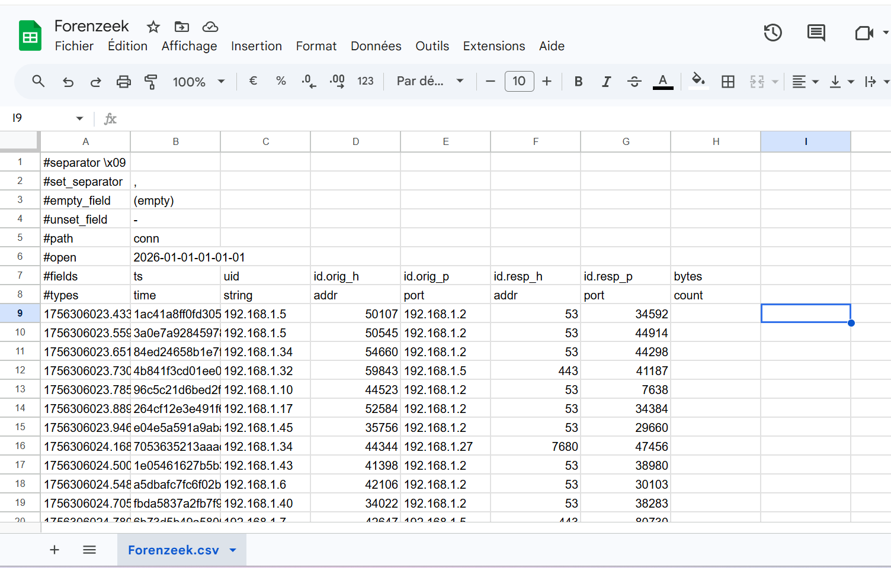
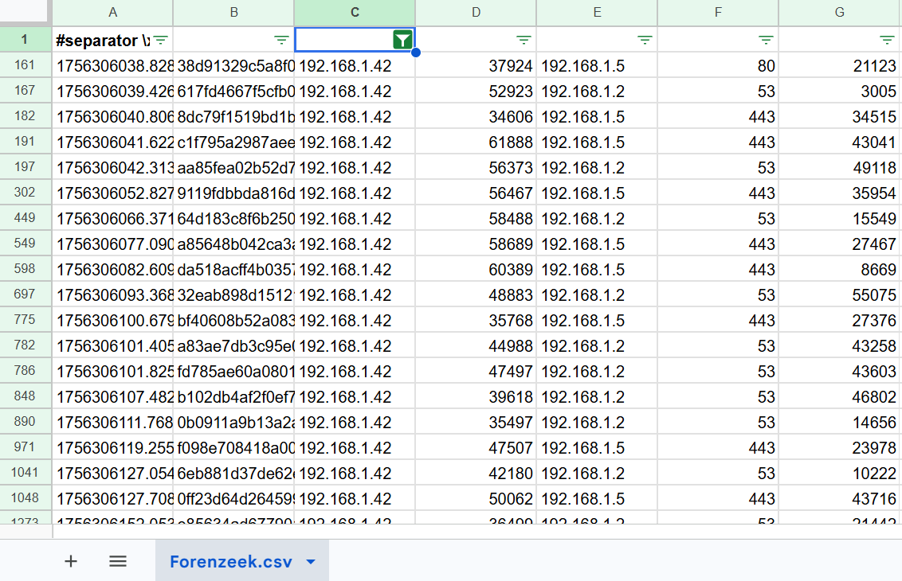
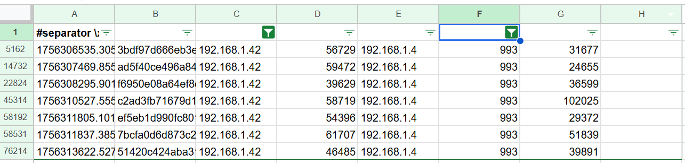
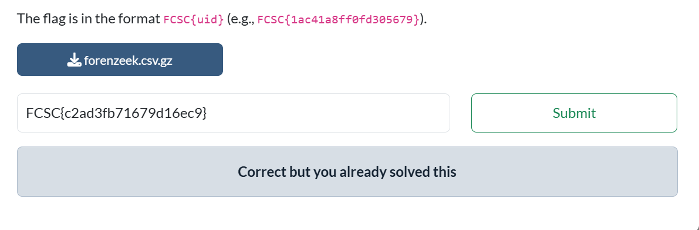

# FCSC26 - Forensic - Forenzeek - Compromission Initiale

## Énoncé

Des logs réseau issus de l'outil **Zeek** ont été collectés sur un réseau dans lequel un attaquant a été repéré. Seule une partie des champs des logs de Zeek sont disponibles.  
Une compromission a été observée sur la machine dont l'adresse IP est `192.168.1.42`.  
Cette compromission a été réalisée via un **email malveillant** contenant une charge utile assez volumineuse.

> Pouvez-vous retrouver l'`uid` de la connexion associée au téléchargement du mail ?
> *(ex: `1ac41a8ff0fd305679`)*

---

## Résolution

J'ai travaillé entièrement sur **Google Sheets** pour ce challenge.

### Étape 1 — Filtrer par IP source

On nous indique que la victime a téléchargé une pièce jointe dans un mail.  
L'IP d'origine de la ligne recherchée correspond donc à celle de la victime : `192.168.1.42`.

### Étape 2 — Filtrer par port destination

Le second critère : la compromission s'est faite par le téléchargement d'un mail malveillant.  
Cela correspond au port destinataire **993** — IMAP over implicit TLS.

### Étape 3 — Identifier le payload le plus volumineux

Le troisième indice de l'énoncé est que le payload du mail est **assez volumineux**.  
La ligne recherchée est celle qui a le plus gros `bytecount` (colonne G) : **102025**.  
Le flag est donc l'uid de la ligne identifiée à l'étape 3. (Ligne 45315, Colonne B, sur l'image en haut.)

