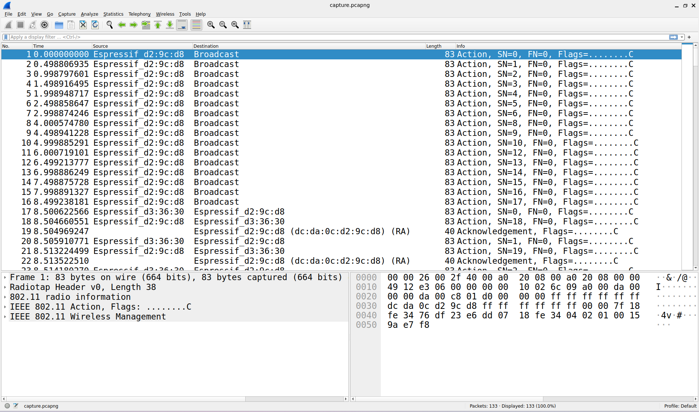
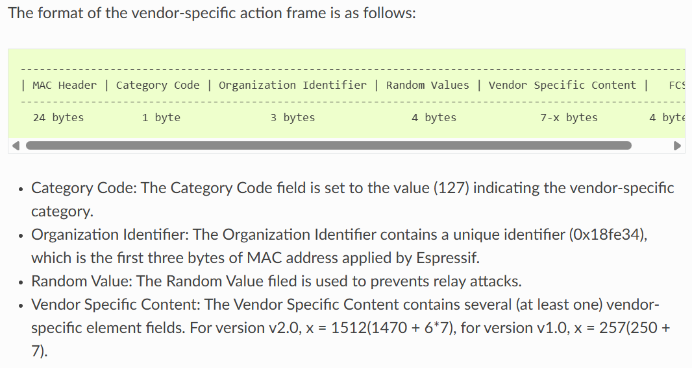
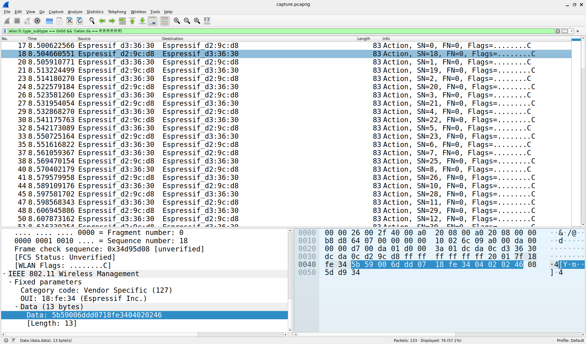
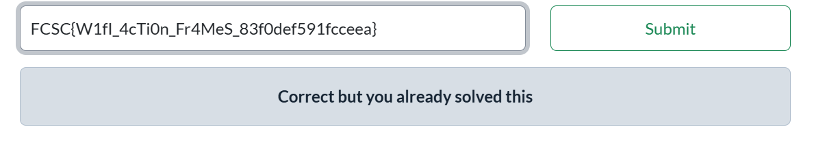

# FCSC26 - Hardware - Maintenant, l'ESP!

## Description

Wi-Fi communication isn't limited to devices on the same access point. Direct communication between devices is possible using certain protocols. ESP-NOW is one example.

What were my two ESP32s talking about?

---

## Resolution

We are given a pcapng file.

It contains the communication through ESP-NOW of two ESP32 devices as per the description.  
Source of the documentation protocol :  
https://docs.espressif.com/projects/esp-idf/en/stable/esp32/api-reference/network/esp_now.html

Combining Wireshark and the protocol documentation, here is the walkthrough :  
-One device has address dc:da:0c:d2:9c:d8. We'll call him E1.  
-The other has address dc:da:0c:d3:36:30. We'll call him E2.  
-In the first frames E1 sends Action frames, broadcasting until it receives the first Action frame from E2.  

-At that moment E1 sends Unicast messages to E2 specifically, sending him one byte of the flag.  
Let's dive into the details :  
-E2 sends Acknowledgement frames to E1 but those do not contain any data and thus are not of interest to us.  
This allows us to filter the pcapng `wlan.fc.type_subtype == 0x0d && !(wlan.da == ff:ff:ff:ff:ff:ff)`  
(remove the broadcast and the ACK frames)  
-Action frames are very easily analyzed because the Organization Identifier is a constant : `0x18fe34`

-Thanks to this direct identifier, and the fact that Wireshark says the last 4 bytes are "Frame check sequences"  
we deduce there are only 2 actual Vendor Specific Content bytes that interests us.  
More specifically the 2 bytes are in this form :  
-01 00 when E1 was broadcasting  
-02 X from E1 when unicasting to E2, where X is an actual byte of the flag  
-03 X from E2 to E1, where E2 is Acknowledging that he received a '02 X' action frame from E1.  

All is left is to export the data payloads from the Action frames of both devices.  
Reconstruct the flag with the following algorithm :    
-If the last 4 byte are of the form 02 X, add it to the string  
-If the last 4 bytes are of the form 03 X, only add it to the string if the previous payload wasn't of the form 02 X.  
(Cheeky challmaker !)

---
