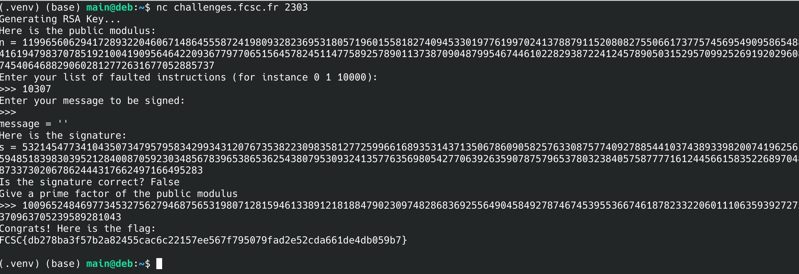

# FCSC26 - Side Channels and Fault Injections - Provably Secure Signature

## Description

It's a shock for Mr. CRT1: he has just learned that, with the right protocol, the RSA signature scheme is not vulnerable to the famous Bellcore attack.

Confident, he decides to implement RSA without verifying the signature.

---

## Resolution

This challenge involves factoring the public modulus of an RSA cryptosystem.

```python
if __name__ == "__main__":
    try:
        # Key generation
        e = 2 ** 16 + 1
        bitsize = 1024
        print("Generating RSA Key...")
        key = RSA.generate(bitsize, e = e)
        print("Here is the public modulus:")
        print(f"n = {int(key.n)}")

        # Get user input
        print("Enter your list of faulted instructions (for instance 0 1 10000):")
        L = input(">>> ")
        faults = { int(x) for x in L.split() }

        print("Enter your message to be signed:")
        message = str(input(">>> "))
        print(f"{message = }")

        # Initialize
        code = open("rsa-sign.asm").read().splitlines()
        code = assembly(code)
        machine = FaultedMachine(code, faults)

        h = SHA256.new(message.encode("utf-8"))
        EM = PSS_encoding(h, bitsize)
        s = sign(machine, EM, key)
        print("Here is the signature:")
        print(f"s = {int(s)}")

        print(f"Is the signature correct? {verify(h, long_to_bytes(s, bitsize >> 3), key)}")

        # Check key recovery
        print("Give a prime factor of the public modulus")
        potential_factor = int(input(">>> "))
        if potential_factor == key.p or potential_factor == key.q:
            flag = open("flag.txt").read().strip()
            print("Congrats! Here is the flag:")
            print(flag)
        else:
            print("Nope!")
    except:
        print("Please check your inputs.")
```

We are to provide a message, which will be signed through the RSA-PSS protocol, through a custom virtual machine that allows us to replace specific instructions with `NOP` (No Operation). We do so by providing a series of numbers identifying the instructions to fault.

First, notice that the description mentions an attack known as the Bellcore attack. Also known as the Boneh-DeMillo-Lipton attack, it targets the RSA cryptosystem,  specifically the RSA-CRT version.

Standard RSA signing is done by performing an exponentiation modulo the public modulus `N`. That is, the signature `s` of a message `m` equals `pow(m, d, N)`, where `d` is the private exponent, while the verification process checks whether `m` equals `pow(s, e, N)`.

In RSA-CRT, we instead create two smaller (and thus faster to compute) signatures `Sp` and `Sq`, which are combined to form the signature `S` through the Chinese Remainder Theorem:

```
S = CRT(Sp, Sq)
```

The Bellcore attack is one of the most prominent attacks on RSA-CRT and proceeds as follows:

- Inject a fault during the computation of either `Sp` or `Sq`, while leaving the other signature correct. This produces a faulty signature `S'`.
- Compute `gcd(N, S - S')`. This equals either `p` or `q`, one of the two prime factors of `N`.

Why does this work? Suppose `Sq` is corrupted. Then `S` and `S'` are equal modulo `p` (since the `Sp` half is unaffected) but differ modulo `q`. Consequently `p` divides `S - S'` while `q` does not, so `gcd(N, S - S') = p`.

However, in this challenge we only get one signature, so we cannot use that formula. Alternatively, the Bellcore attack can be carried out by computing `gcd(N, m - pow(s, e, N))` from a single faulty signature. But that formula is also unusable here, since the RSA-PSS protocol does not sign the actual message `m` but rather an encoded version of it generated with random padding:

```python

def PSS_encoding(h, bitsize):
    randFunc = Random.get_random_bytes #this makes EM random
    mgf = lambda x, y: MGF1(x, y, SHA256)
    sLen = h.digest_size
    EM = bytes_to_long(_EMSA_PSS_ENCODE(h, bitsize - 1, randFunc, mgf, sLen))
    return EM

```

So we have to use an alternate attack. Let's check the assembly code of the RSA-sign function used to produce the signature:

```assembly
;input
; R5: msg
; R6: p
; R7: q
; R8: iq
; R9: dp
; RA: dq
;output
; R0: CRT( msg ** dp [p], msg ** dq [q] )
main:
    MOV     R0, R5
    MOV     R1, RF
    CMP     R5, RF
    JCR     messageOK
    STP                 ;message to sign is 0 or 1
```

`RF`, which here stores the Program Counter (PC) value, is used to check whether the message stored in `R5` equals 0 or 1. If it isn't, we jump to the `messageOK` section.

```assembly

messageOK:
    ;Save msg, p and prepare exponentiation
    MOV     RB, R6      ;RB = p
    MOV     R6, R7
    MOV     R7, RA
    MOV     RA, R5      ;RA = msg
    ;Compute Sq
    CA      exponentiation
    MOV     RC, R6      ;RC = q
    ;Compute Sp
    MOV     R5, RA
    MOV     RA, R0      ;RA = Sq
    MOV     R6, RB
    MOV     R7, R9
    CA      exponentiation
    ;Compute S = [(Sp-Sq)*iq mod p] * q + Sq
    ADD     R0, R0, R6
    ADD     R0, R0, R6
    MOV     R3, RA
    SUB     R0, R0, R3
    MOVRR   R1
    MOV     R7, R8
    MM      R0, R0, R1
    MM      R7, R7, R1
    MM      R0, R0, R7
    MM1     R0, R0
    MOV     R2, RC
    MUL     R0, R0, R2
    ADD     R0, R0, R3
    STP
```

The instruction `MOV RA, R0  ;RA = Sq` stores `Sq` in `RA`, as the comment indicates. Following that, only one further instruction reads `RA`: `MOV R3, RA`, which means `R3 = Sq`. We then notice that the last instruction of the whole program is `ADD R0, R0, R3`, which adds `Sq` to `R0`. This corresponds to the `+ Sq` term in the comment `;Compute S = [(Sp-Sq)*iq mod p] * q + Sq`.

Here is the attack: if we skip this final instruction, the value left in `R0` is

```
S' = [(Sp - Sq) * iq mod p] * q
```

After the chain of `MM`/`MM1` operations on the preceding lines, `R0` already holds this quantity as a regular integer (the final `MM1` converts out of Montgomery form). Since `S'` has `q` as an explicit factor, it shares `q` with `N = p * q`, and therefore `q = gcd(N, S')`.

All that's left is to determine the index this instruction resolves to.

The `runCode` method of the `Machine` class comes with a debug mode. Running the script in debug mode with no faulted instructions yields:

```
#debug output of the previous instructions
================================================================================

4ac0
ADD	R0, R0, R3

#values of a, b, R0, R1 ... up to RF and of Error
counter =  10308
<crypto_accelerator.Fp_machine object at 0x7081d7100e90>
================================================================================

1400
STP

#values of a, b, R0, R1 ... up to RF and of Error
counter =  10309
<crypto_accelerator.Fp_machine object at 0x7081d7100e90>

```

So `counter = 10308` for `ADD R0, R0, R3`. Since the first instruction is the 0th and the counter is incremented only after each instruction executes, the `ADD R0, R0, R3` instruction has index **10307**.



---

### Why does a normal execution always run 10308 instructions?

For completeness, let's see where this number comes from. We saw in the `messageOK` function that there are two calls to the `exponentiation` function. Let's analyze it:

```assembly

; R1: 1
; R5: msg       (size of public modulus)
; R6: modulus
; R7: exponent
; R0: msg**exponent [modulus]
exponentiation:
    MOV     RD, RE                  ;Save LR
    BTL     R3, R6
    ADD     R4, R3, R3
    FP      R6, R4                  ;FP with modulus on double size
    MOVRR   R4
    MM1     R5, R5
    MM      R5, R5, R4              ;msg mod modulus
    MOV     R2, #64
    SLL     R2, R4, R2
    MM1     R2, R2                  ;RR for modulus on simple size
    FPRR    R2, R6, R3
    MM      R5, R5, R2              ;msg in Montgomery format
    MM1     R0, R2                  ;initialize result with 1.R
    MOV     R4, =tabOperation
    JR      startExponentiation_loop

```

The instruction `BTL R3, R6` stores the bit length of `R6` in `R3`. `R6` equals `p` (or `q` on the second call), which is half as long as `N`. With `N` being 1024 bits long, `p` and `q` are 512 bits long.

Notice that `R4` stores the address of the `tabOperation` function.

Then comes the final part of the analysis:

```assembly

exponentiation_loop:
	AND	 R2, R7, R1			  ;get lsb
	SRL	 R7, R7, R1			  ;drop lsb
	ADD	 R2, R2, R4			  ;select operation according to lsb
	MOVCW   R2
	CA	  R2
startExponentiation_loop:
	SUB	 R3, R3, R1
	JCR	 exponentiation_loop
	MM1	 R0, R0
	MOV	 RE, RD				  ;Restore LR
	RET
tabOperation:
	.word   =bit0, =bit1

bit1:
	MM	  R0, R0, R0
	MM	  R0, R0, R5
	RET
bit0:
	MM	  R5, R5, R5
	MM	  R5, R5, R0
	RET

```

This is the core loop that computes `Sp` into `R0` (and `Sq` on the second call). `R7` stores `dp` (or `dq` on the second call). For each bit of `R7`, we either perform `bit0` or `bit1`.

`R7` may have fewer than 512 actual bits, but it doesn't matter, since the loop is performed with:

```
SUB	 R3, R3, R1
JCR	 exponentiation_loop
```

`SUB` sets the carry flag to `True` if `R3 >= R1`, otherwise to `False`. `JCR address` then jumps to `address` if the carry flag is set. So the loop continues while `R3 >= 1`, i.e. it runs exactly 512 iterations regardless of the actual bit length of the exponent.

Each loop iteration is 10 instructions long (5 in `exponentiation_loop`, 3 in `bit0`/`bit1`, and 2 at the start of `startExponentiation_loop`), so we get:

```
2 (calls to exponentiation)
* 512 (iterations per call, since R3 starts at 512)
* 10 (instructions per iteration)
= 10240 instructions
```

The remaining 68 instructions are the deterministic setup and teardown of `main`, `messageOK` and `exponentiation`, which always execute the same way regardless of the input. Together this gives 10308 instructions, explaining why a normal execution has fewer than 100 distinct instructions in `rsa-sign.asm` but executes 10308 of them.

---

### Putting it all together

Submitting `10307` as the only faulted instruction skips the final `ADD R0, R0, R3`, which yields a faulty value `s'` such that `gcd(N, s') = q`. Recovering this prime factor and submitting it to the challenge unlocks the flag.
