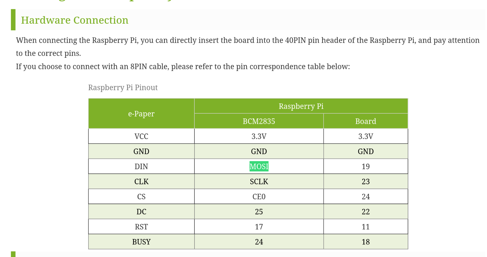
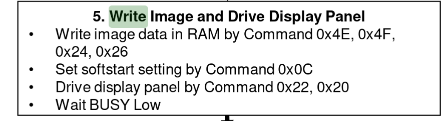
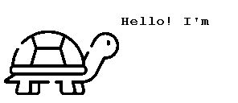
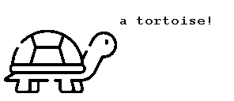
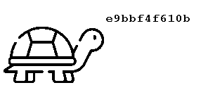
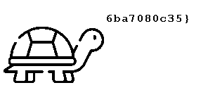
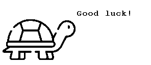

# FCSC26 - Hardware ** - Tortoise Say  

## Description
After Shrimp Say, here comes Tortoise Say!  

Tortoise Say is a revolutionary embedded system based on e-Ink technology.  
A drawn turtle eagerly displays a secret for you.  

We provide you with a capture made using a logic analyzer of the communication with the screen while the turtle was displaying the flag.  
The screen used is a Waveshare 2.9inch e-paper V2.  

The pins measured on the logic analyzer are:  

    D0: DIN  
    D1: CLK  
    D2: CS  
    D3: DC  
    D4: RST  
    D5: BUSY  

Will you be able to recover the turtle’s secret?  

---

## Résolution  
Let's start with understanding the signals :  
-BUSY=1 indicates the screen is refreshing, 0 if it is ready to receive new data. This signal can be ignored.  
-RST can also be ignored. It just goes from 0 to 1 to indicate the controller is ready.  
-CS is the Chip Select signal : we ignore the signal if it equals 1  
-DIN is the signal that contains the actual data : we will construct bytes bit by bit on that signal.
It corresponds to the MOSI signal in 
the SPI protocol (Master Output, Slave Input)  

-DC is the signal that allows us to understand whether the byte we are dealing with is the codebyte for a command, or if it's an actual databyte.  
More specifically, the command that indicates that we want to write is 0x24.  
Source :
https://www.crystalfontz.com/controllers/uploaded/SSD1680.pdf#page=39  

-when CLK goes from 0 to 1 we understand that we have to read the DIN. (bit banging communication)  

Once we understand the signals we construct the images with a script and we deduce the flag from the images. 

  
  
  
  
  
  
  
---
