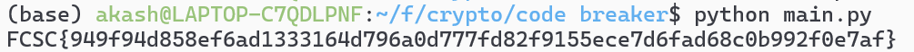

# FCSC26 - Crypto - Code Breaker

## Mise en place

Extraire les fichiers fournis :

```bash
tar -xf output.txt.tar
```

Puis lancer le solver :

```bash
python3 solver.py
```

---

## Contexte

Le programme chiffre le flag avec **AES-128 en mode CBC**. Le but est de retrouver la clef, dont la construction se fait ainsi :

```python
key = sum(b << i for i, b in enumerate(key)).to_bytes(32)
```

sachant que `key` avait déjà été construit ici :

```python
for i in range(256):
    b = rng.integers(0, 2)
    key.append(int(b))
    if b: G = random_matrix(Fq, k, n, rng)
    else: G = random_grs(Fq, k, n, rng)
    C = generate(Fq, G, rng)
    d[i] = [ int(_) for _ in C.flatten() ]
```

On nous fournit le contenu de `d`, le chiffré ainsi que l'IV utilisé. On doit donc partir de `d` pour retrouver les valeurs de `b`.

---

## Construction de C

Voici la fonction qui construit `C` :

```python
def generate(Fq, G, rng):
    k, n = G.shape
    S = random_matrix(Fq, k, k, rng)
    P = random_permutation_matrix(Fq, n, rng)
    return S @ G @ P
```

---

## Distingueur : le carré de Schur

Pour déterminer la valeur du bit, il faut savoir distinguer un **code de Reed-Solomon Généralisé** d'une matrice quelconque. Le **carré de Schur** est un distingueur pour les codes à structure algébrique.

Plus précisément :

- La dimension du carré de Schur d'un **code aléatoire** est ≤ `min(n, C(k+1, 2))` — cette borne est atteinte si le code n'a pas de structure algébrique.
- La dimension du carré de Schur d'un **code GRS** est `2k - 1 = 39`, car le produit de deux polynômes de degré < k est un polynôme de degré < 2k - 1.

La multiplication de `G` par `S` et `P` ne change pas cette propriété.

---

## Reconstruction de la clé

| Dimension du carré de Schur de `C` | Valeur du bit `b` |
|:---:|:---:|
| 64 | 1 |
| 39 | 0 |

