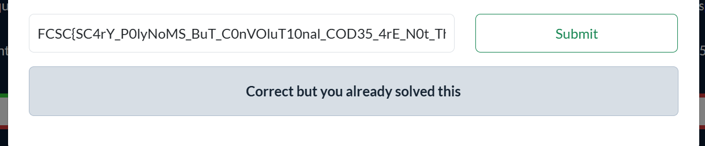

# FCSC26 - Hardware - Convolu-quoi?

## Énoncé

Convolutional codes are frequently used in wireless communication standards: in mobile networks, in Wi-Fi, but also in space transmissions. With a convolutional code, a message m(x) is multiplied bit by bit by two defined polynomials p1(x) and p2(x).
For example, in GSM (also called second generation mobile network, 2G), two outputs are calculated: c1(x) = m(x) * p1(x) and c2(x) = m(x) * p2(x). The transmitted message alternately contains the bits of c1(x) and c2(x).
Here, you have a flag encoded by the polynomials G0 = X^4 + X^3 + 1 and G1 = X^4 + X^3 + X + 1 defined in the GSM standard. Will you be able to recover the flag?

---

## Résolution

This challenge is straight-forward : Each bytes of the output depend of one byte of the input(flag).
But there is no dependancy between the output bytes.

```go
func convolve(sequence []uint8, G0, G1 uint8) []uint8 {
	res := make([]uint8, 0)
	var state uint8 = 0
	for _, bit := range sequence {
		state = (state << 1) | bit
		res = append(res, parity(state&G0))
		res = append(res, parity(state&G1))
	}
	for range 4 {
		state = (state << 1)
		res = append(res, parity(state&G0))
		res = append(res, parity(state&G1))
	}
	return res
}
```

For the last 8 bytes, those do indeed depend on the entire flag,
But for the bytes of the first loop, we observe that :
-For each of the 8 bits of a byte of the flag, 2 bits are appended
-Those 2 bits take in count the parity of the variable state
-At any iteration K, the state only depends on the 1 to K bits and not the K+1 upcoming bits.

Which means that you can reconstruct the flag byte per byte.
And we know that the flag only contains alpha-numerical Ascii characters, which is a small window and doesn't take long to compute.



---
