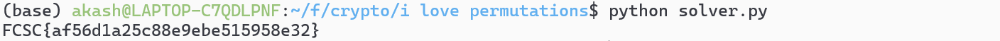

# Writeup — FCSC26 - Crypto ** - I Love Permutations

## Énoncé

On vous donne le chiffré du flag, que vous devez retrouver après avoir effectué **6 requêtes** à un oracle de chiffrement.

```python
print(f"Flag hex : {ILP.encrypt(flag[:16]).hex() + ILP.encrypt(flag[16:32]).hex()}")
```

---

## Fonctionnement du chiffrement

```python
def encrypt(self, m):
    assert len(m) == 2 * self.n // 8, "Invalid message length"
    l = self.branch_to_bits(m[:self.n // 8])
    r = self.branch_to_bits(m[self.n // 8:])
    for _ in range(self.r):
        random.seed(self.bits_to_branch(l))
        random.shuffle(r)
        random.seed(self.k)
        random.shuffle(r)
        random.seed(self.bits_to_branch(r))
        random.shuffle(l)
        random.seed(self.k)
        random.shuffle(l)
    return self.bits_to_branch(l) + self.bits_to_branch(r)
```

Pour `m = (l, r)` avec `l` et `r` différents de `0`, `encrypt(m)` applique `R` rounds de permutations sur `l` et `r`.
Plus précisément, chaque round c'est : l'application d'une permutation aléatoire générée par l'état mélangé des bits de `l`/`r`, puis la permutation générée par la clé k.

---

## Analyse et vulnérabilité

Notons **Pₓ** la permutation générée par la seed `x`.

On observe que si `m=(l,0)`, alors peu importe le nombre de rounds R :

```
encrypt(l,0)=(Pk·P0)^R (l) | 0=X(l) | 0
```

avec **X** une permutation inconnue. On se retrouve donc avec un chiffrement beaucoup plus vulnérable.

---

## Attaque

### Étape 1 — Reconstruire X

Avec **6 requêtes** de la forme `Lᵢ | 0`, on peut deviner l'image de `0` à `63` par `X` et donc reconstruire la **matrice de X**.

Li se construit ainsi : son j-éme bit est égal à (j>>i)&1.

À partir des 6 sorties, chaque position de sortie p donne un index 6 bits = X⁻¹(p).
Ceci découle du fait que `2⁶=64`, qui est précisément la taille de l'entrée d'`encrypt`.

### Étape 2 — Retrouver Pk

La seconde observation clé est que `R=101`, qui est premier. Donc `X⁻ʳ=Pk·P0` est unique.

Comme on connaît `P0`, on en déduit 'Pk' et on peut déchiffrer le flag normalement.


