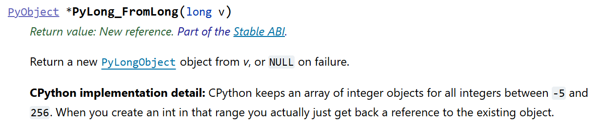
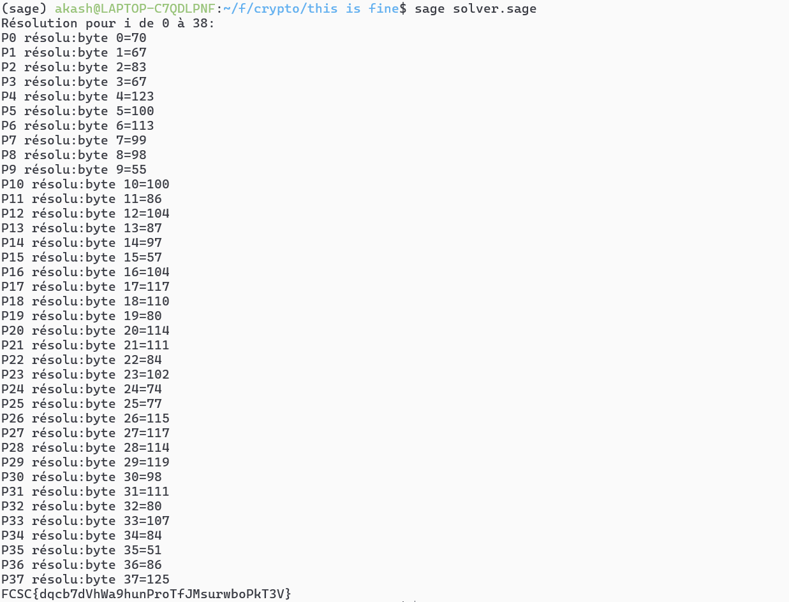

# FCSC26 - Crypto - This is fine

## Contexte

Ce challenge met en jeu un tableau de polynômes de degré 16.

```python
flag = []
for y in L:
    this = int(input(">>> "))
    fine = int(input(">>> "))
    assert this == fine
    this = y(this)
    fine = y(fine)
    assert this is fine
    flag.append(this | fine)
print(bytes(flag).decode())
```

---

## Objectif

Pour chaque polynôme, trouver une valeur telle que, si on l'évalue deux fois, les deux variables feront référence au **même objet mémoire**.

Ceci se produit lorsque la valeur stockée est petite, entre **-5 et 256**.
> Source : [docs.python.org — C API / Long](https://docs.python.org/3/c-api/long.html)

Comme l'évaluation du polynôme est considérée comme un byte du flag, on sait qu'il faut trouver `x` tel que `p(x)` soit entre **0 et 255** pour chaque polynôme de `L`.

---

## Résolution

On cherche à résoudre, pour tout `p` de `L` :

```
p(x) = k,  avec k ∈ [0, 255]
```

Ce qui revient à résoudre `P(X) = 0` avec `P = p - k`.

### Théorème des racines rationnelles

Toute racine entière non nulle d'un polynôme à coefficients entiers divise son terme constant.

Pour un polynôme :

```
P(X) = aₙXⁿ + aₙ₋₁Xⁿ⁻¹ + ... + a₁X + a₀
```

Si `x` est racine de `P` :

```
aₙxⁿ + aₙ₋₁xⁿ⁻¹ + ... + a₁x + a₀ = 0
```

donc :

```
x (aₙxⁿ⁻¹ + aₙ₋₁xⁿ⁻² + ... + a₁) = -a₀
```

### Algorithme

Pour tout polynôme `p` de `L` :

- Pour `k` de `0` à `255` :
  - On récupère `a₀` (c'est la valeur de `p` en `0`)
  - Pour chaque diviseur `x` de `a₀ - k` : si `x` est racine, alors `p(x)` vaut `k`, donc le byte du flag vaut `k`

> **Note :** lorsque `a₀` est négatif, c'est un diviseur négatif qui est la solution !

